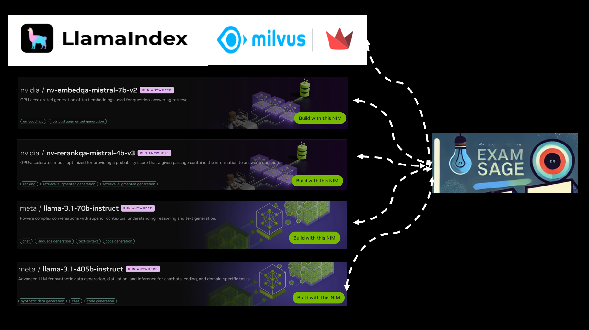

# Meet Exam Sage, your exam assistant
Exam Sage prepare your exam questions in any way you like. Using your materials, like lecture notes, slides, PDFs, charts, or anything else, along with Exam Sage's knowledge base, you can create multiple-choice, short-phrase or essay questions with Exam Sage.
That’s not all! Exam Sage will act as a TA during the exams and can offer hints and support an open-book environment for students. Plus, Exam Sage can do reference grading for your exam! 

####  #NvidiaDevContest #LlamaIndex

### Exam Sage Instructor Main Screen 
* In the instructor module, you can create questions with your own materials.
*                          
 

### Exam Sage Student Main Screen 
* In the student module, students can answer the questions and see the reference grading.
* 
 

#### Video Demo - Click to see the demo video
* The files uploaded in this demo can be found in the ```./demo_files``` directory for your own verification
* [](https://www.youtube.com/watch?v=TNIGRqrm2yo&t=9s)


# Technologies
 
Exam Sage is built on RAG, an agentic database, LLM, and other underlying technologies.  

* [NVIDIA NIM Microservices](https://build.nvidia.com/explore/discover)  for hub to language models
* [NVIDIA Nemo Retriever/nv-embedqa-mistral-7b-v2]( https://build.nvidia.com/nvidia/nv-embedqa-mistral-7b-v2) for the embedding model (Embedding leaderboard No.1 model) with 4096 embedding size
* [meta/llama-3.1-70b-instruct](https://build.nvidia.com/meta/llama-3_1-70b-instruct) for inference 
* [meta/llama-3.1-405b-instruct](https://build.nvidia.com/meta/llama-3_1-405b-instruct) for natural language agentic DB interaction through Llamaindex
* [Llamaindex Framework](https://www.llamaindex.ai) for RAG, agentic DB and underlying framework
* [Milvus](https://milvus.io) for Vector DB
* [Steramlit](https://streamlit.io) for UI

**Plus**
* [NVIDIA Nemo Retriever/nv-rerankqa-mistral-4b-v](https://build.nvidia.com/nvidia/nv-rerankqa-mistral-4b-v3) for reference grading on student answers

**Dropped**
* [Nvidia NemoGuardrails](https://docs.nvidia.com/nemo/guardrails/introduction.html) - I installed Nemoguardrails seperately and worked fine. But when it was incorporated, it conflcted with libraries. Nemoguarrails seems not incorporated into framework yet (see [here](https://discord.com/channels/1059199217496772688/1300914700074225685/1301267204880470037)). I did all kinds of mix among llama-index-agent-openai, llama-index-embeddings-openai and llama-index-llms-nvidia, but it didn't work out. Nemoguardrails worked as controlling students input and moderations ( which iswell-tailored for input, output, and hallucination) but I dropeed it in the last few days.


# Background
The idea grew from open-book exams, which are a great way to test students' understanding of concepts rather than their ability to memorize facts. Now, with LLMs and relevant technologies, we can implement open LLM exams, where instructors can provide students with flexible environments and students can focus on problem-solving rather than searching through books and the internet.
I expanded this idea to genral exams in  K-12 schools, colleges, companies or certificate providers. 
And I added grading feature for instructors as well as students can use as reference grading using reranking embediing model.


# Setup

## Hardware
No GPU required.
Exam Sage uses Nvdia NIM service. Sign up, and you can use free 1000 credits. Link here (https://build.nvidia.com/explore/discover). Get API from there.

## Envoronment
Set up The API key in your local machine
```
export NVIDIA_API_KEY="nvapi-..."
```
Then create your environment and install packages.
```
conda create -n myenv python=3.10.15
conda activate myenv
```
## OS
Linux (Ubuntu 20.2), 
## Installation
```
git clone https://github.com/gigit0000/nvidia-llamaindex-contest/
cd nvidia-llamaindex-contest
pip install -r requirements.txt
```
If SQLite was not installed in your machine,
```
sudo apt install sqlite3
```

## Run

For Exam Sage Instructors, run 
```
streamlit run appinput_db.py
```

After completing creating questions, run the following for Exam Sage Students 
```
streamlit run appinput_exam.py
```


Note that:
1) If timeout errors in Nim microservices occur, just click "Finalize" button again in Instrutors or "Submit" in Students after a little break. Then it will work and show the table format of the questions and answers, or the reference grading.
2) But sequetial timeouts generate an ```Invaild API Key``` error. It is not a problem of your key. Just take a longer break and try again (hard learned facts). It works.
3) When you try to run another round of Instructors, use this script to clear out the past vector DB:
    ```./del_db```
   If the past vectod DB is not cleared, then the index on the documents in the previous run is reflected on the current run of this app. This operation was placed in the main code, but due to 1) and 2), which would delete the vector db without SQL inserting and saving, it was seperated.
4) In the ```documents upload pane```, currently MS Office formats give an "Empty Response" error ([see here](https://github.com/run-llama/llama_index/issues/8806)). So convert them to PDF first and then upload.    

-------------------

# Workflow and Features


### Instructors
#### Workflow
1) First, instructors enter their information
2) On the next screen, upload the documents to create exam questions
3) Start talk with Exam Sage. Exam Sage helps instructors choose from various question options, like how many questions there will be, the difficulty level (easy, medium, or hard), the type of questions (such as multiple choice, short phrase answers, or essays), and whether hints can be given during the exam.
4) Confirming the questions Exam Sage shows, click the "Finalize" button. The exam questions will then be saved to the database.
#### Methodological Perspective
* You can create questions based only on the documents you've uploaded, or from Exam Sage's knowledge base. But the best option is let Exam Sage work, which allows you to generate even more creative questions.

* LlamaIndex is powerful enough to manage the RAG flow as well as handle an agentic database. NLSQLTableQueryEngine can not only query entries but insert entries using natural language, which I guess weren’t even recognized by the team. But I found it works! ([see this](assets/llamaindex_discord.png)).

* In the original version, questions are immediately saved to DB by the DB agent during the chat as the instructor confirms. But due to timeouts in Setup/Run/1) as described in the above, now DB agent inserts questions at the end once Finalize button is clicked.

### Student
#### Workflow
1) First, students enter their information. Incorrect organization and exam names are not allowed.
2) Exam questions are displayed. Students can communicate with Exam Sage and get information as long as it is not directly or indirectly related to the answers to the questions. This enables an open-book exam.
3) Exam Sage guides students in answering the questions. For questions that allow hints from the instructor, Exam Sage provides them.
4) Click the "Submit" button after the student has answered all the questions.
5) The correct answers along with the reference gradings are displayed.

**Exam Sage enables faster feedback and scoring for students, which can help them understand their performance more quickly, and also give potential time-saving and administrative benefits for instructors by automating grading and feedback**


#### Methodological Perspective
* The gradings are logit values from the Nvidia Reranking model. The logit in Grading 1 corresponds to the student's answer, while the logit in Grading 2 corresponds to the correct answer given by the instructor. If we compare the values, we can estimate whether the student's answer is correct, near correct or incorrect. This is good enough for refernce grading to help students to see immediate results and to give reference to instructors.
* Furthermore, with a scaling factor, the logit values were supposed to be transformed into a 100-point scale and/or a letter grading system based on the student's answer only, as the reranking model provides an absolute value for the same question.
* During the test, however, the reranking model was found to be unstable ([see here](assets/rerankign_Test_seoul2.PNG)). So, I added the teacher's answer to compare both logits and make an estimate. At this stage, it should only be used as an estimate in comparison to the correct answer. But again, it give a good reference point.

     
## Supporting Materials and Engagement
* See the materials in ```nvidia-llamaindex-contest/supporting_materials```
* Tech presentation: [See instagram post](https://www.instagram.com/reel/DCLcjCPtMtz/?utm_source=ig_web_copy_link&igsh=MzRlODBiNWFlZA==)
* Also See this for engagement ([1](assets/nvidia_discord1.PNG), [2](assets/nvidia_discord2.PNG), [3](assets/nvidia_comminication_3.png))
* X: [twitter](https://x.com/williamgogo00/status/1855520718181794280)
* Demo [X](https://x.com/williamgogo00/status/1855477493496795492)
* Demo [Youtube](https://www.youtube.com/watch?v=TNIGRqrm2yo)


# Next Version To Do
* Students ID verification process
* Security modules for DB and DB inserts statements

